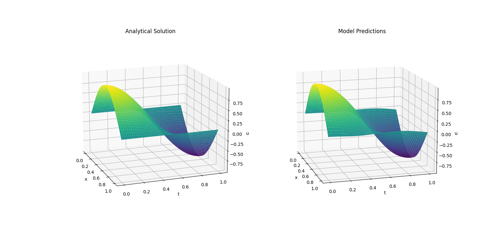

# Solving 1 Dimensional Wave equation using Physics Informed Neural Networks
Just like the heat equation example, we can solve the 1D wave equation using the same Physics Informed Neural Networks (PINNs) approach. The 1D wave equation is given by:

\begin{equation}
\frac{\partial^2 u}{\partial t^2} = c^2 \frac{\partial^2 u}{\partial x^2}
\end{equation}

where \(c\) is the wave speed. The initial conditions are given by:

\begin{equation}
u(x,0) = sin(\pi x)
\end{equation}

\begin{equation}
\frac{\partial u}{\partial t}(x,0) = 0
\end{equation}

and the boundary conditions are given by:

\begin{equation}
u(0,t) = 0
\end{equation}

\begin{equation}
u(L,t) = 0
\end{equation}

where \(u_0(x)\), \(v_0(x)\), \(u_L(t)\), and \(u_R(t)\) are the initial and boundary conditions. The solution to the wave equation is given by:

\begin{equation}
u(x,t) = sin(\pi x)cos(\pi t)
\end{equation}

The model I used in this experiment involves the same architecture as the heat equation example, employing 4 hidden layers, 25 neurons each.

# Results
The model was trained for 1000 iterations over 1000 data points within the specified domain. The loss function is the sum of the mean squared error loss for the initial and boundary conditions, and the PDE loss. The results are shown below:

The model was able to capture the dynamics of the wave equation, as shown in the animation above. The model was able to learn the wave equation and the boundary conditions, and the solution closely resembles the analytical solution.

